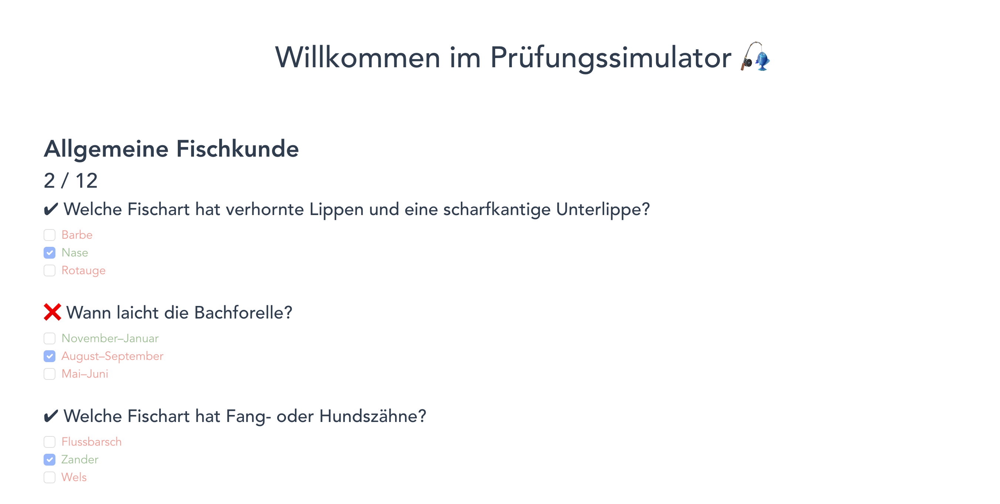
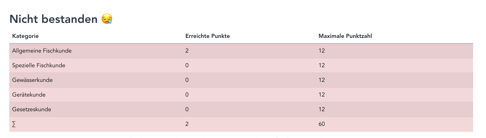

# Fischereiprüfungs-Simulator 🎣
Der Fischereiprüfungs-Simulator kann genutzt werden um für die Fischereiprüfung in Baden-Württemberg zu lernen.
Der Simulator besteht aus zwei Komponenten: Einem Backend (generiert den Fragebogen) und einem Frontend (stellt den Fragebogen dar und wertet ihn aus).

## Features
* Ein Fragebogen kann mit Freunden geteilt werden. Öffnet der Freund den Link, bekommt er den gleichen Fragebogen, mit den selben Fragen. Somit kann man sich untereinander vergleichen und besonders schwierige Fragebögen teilen
* Der Fragebogen wird entsprechend der offiziellen Regeln ausgewertet und du bekommst ein Feedback ob du bestanden hast oder nicht
* Der Simulator arbeitet ohne Logindaten, Datenbanken o.ä. Es reicht die Website aufzurufen und man kann direkt loslegen

## Screenshot



## Weitere, benötigte Dateien
* Fischbilder
* Offizieller Fragebogen


Diese Dateien können aus urheberrechtlichen Gründen nicht zur Verfügung gestellt werden. 

## Setup auf Webserver
1. Fragebogen (state3.json) in den Ordner backend/res kopieren.
2. Fischereibilder in den Ordner frontend/src/assets kopieren (Hinweis: ich musste 3_ von den Dateinamen am Anfang entfernen)
3. Python3 installieren und fastapi und uvicorn installieren. Dann in den Backend Ordner wechseln und mit Screen *uvicorn \_\_init\_\_:app --host 0.0.0.0 --port 8080* den Backend Server starten
4. nginx installieren
5. In den frontend Ordner gehen und mit *npm run build* "kompilieren" (geht auch lokal) und dann den Inhalt des dist Ordners nach /var/www/ kopieren
6. nginx als reverse proxy nutzen (nano /etc/nginx/sites-enabled/default):

```
server {
        listen 80 default_server;
        listen [::]:80 default_server;

        root /var/www/frontend;

        index index.html index.htm index.nginx-debian.html;

        server_name _;

        location ~ quiz {
                proxy_set_header Host $host;
                proxy_set_header X-Real-IP $remote_addr;
                proxy_pass http://localhost:8080;
        }

        location / {
                # First attempt to serve request as file, then
                # as directory, then fall back to displaying a 404.
                try_files $uri $uri/ =404;
        }
}
```

7. Certbot einrichten für ein SSL-Zertifikat
